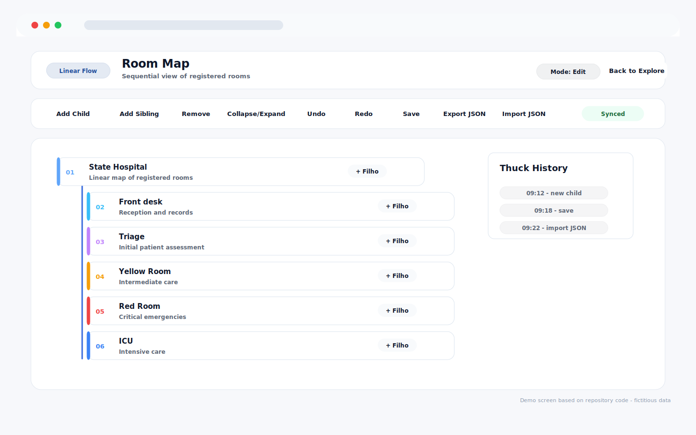
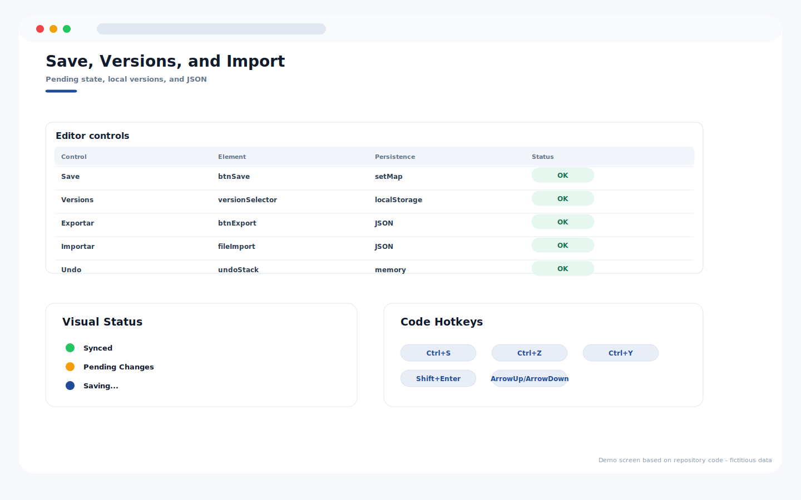

# Room Map Management

Repository: `MAPA_gerenciamento_mapa`

## Overview

Linear room-map editor with explore/edit modes, node actions, local versions, JSON import/export, and synchronization status.

## Main Capabilities

- Linear flow editor for hospital room structures.
- Edit toolbar for child, sibling, delete, collapse, undo, redo, save, export, and import actions.
- Quick history panel and synchronization status.
- Local version selector and JSON backup flow.

## Operating Flow

1. Switch from explore mode to edit mode.
2. Select a node and add children or sibling nodes.
3. Save changes and keep local versions available.
4. Export or import JSON when the map needs to be backed up or restored.

## Visual System Guide

> The screens below are documentation mockups based on the components, labels, colors, and workflows found in this repository. All displayed data is fictitious and does not represent real patients, staff members, or institutions.

### Room Map - linear editor

### Room Map - save, versions, and JSON

## Data Privacy

The repository documentation and guide images use fictitious sample data only.

## Technologies

- JavaScript
- HTML/CSS
- Google Apps Script
- Google Sheets

## Status

Completed
